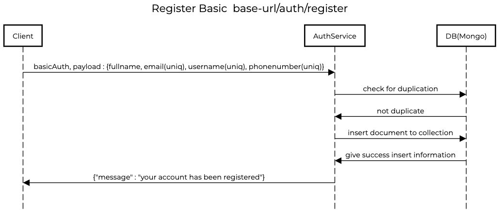
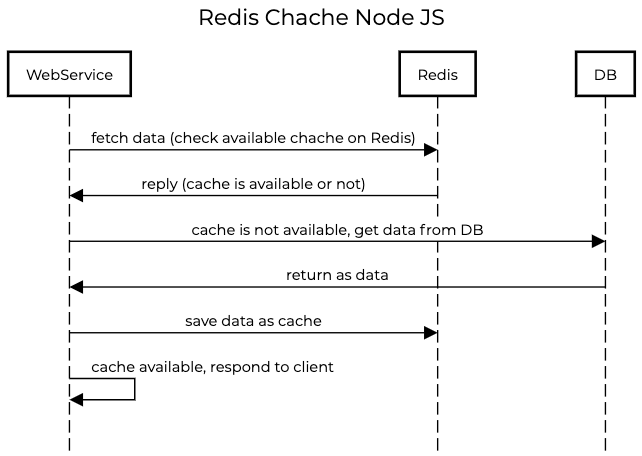

# Caching nodejs using Redis with mongo-db

## Scenario

<details>
  <summary>Register with Basic Auth</summary>  
  
  
</details>

<details>
  <summary>Redis Cache</summary>  
  
  
</details>

## Wanna to try

### Install package
```
npm i
```
### Copy .env.example to .env
```
cp .env.example .env #ducplicate .env
```
### Then modify your .env
```
APP_PORT={{ your port }}

REDIS_HOST={{ your redis host target}}
REDIS_PORT={{ your redis port target}}
REDIS_PASS={{ your redis password }}
```


